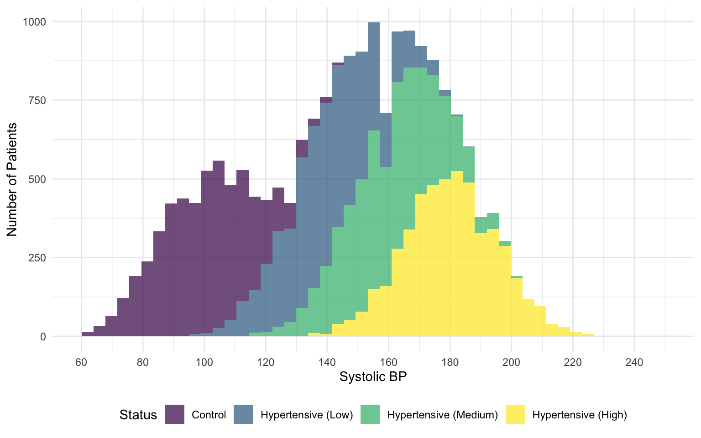
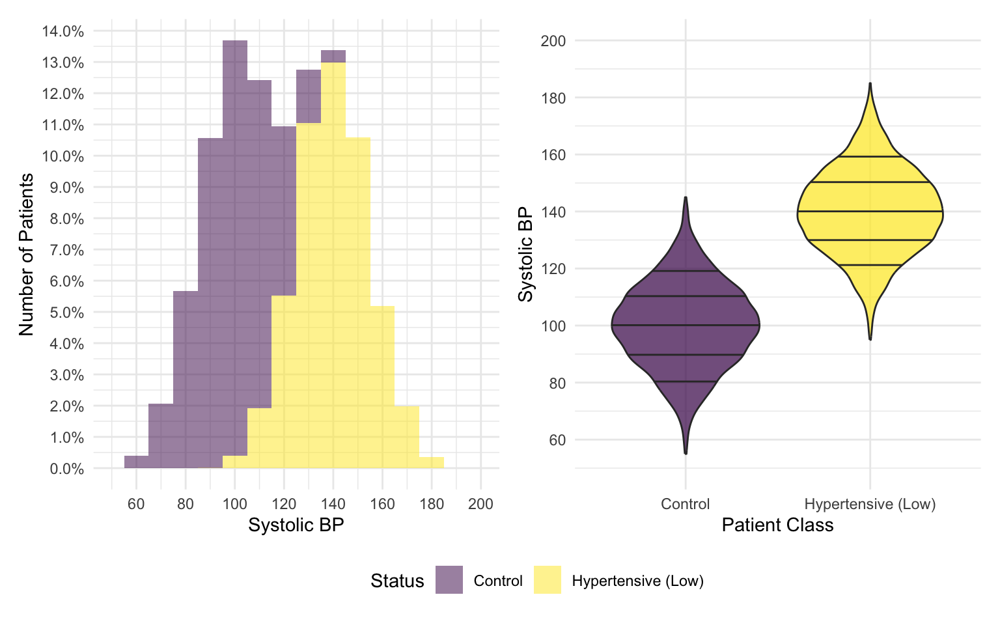
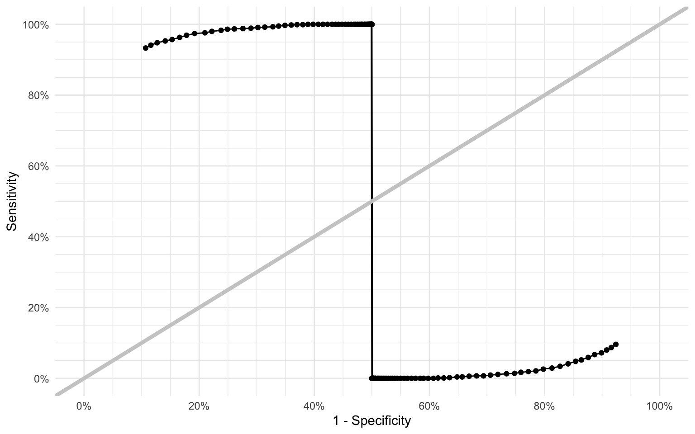
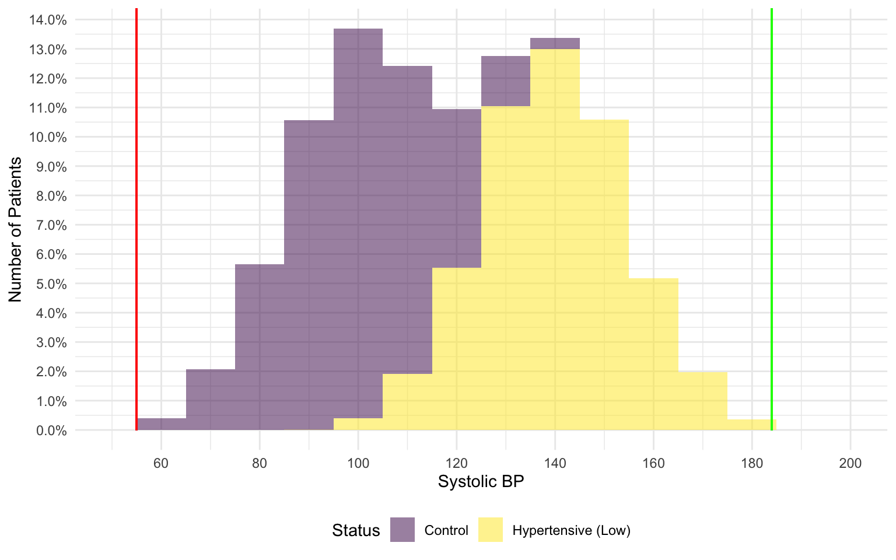

# Introduction

Tests, whether diagnostic or screening, are the mainstay of Medicine.
A major challenge for developing any sort of diagnostic or screening test is
that the measurements and the outcome scales are incompatible. Most, if not all,
parameters recorded in biology are continuous in nature. However, we usually need the
outcome to be binary. This then requires the transformation of the continuous
parameter into a binary outcome by applying a threshold parameter.

The selection of the threshold parameter then becomes paramount in determining
the usefulness of the test in question. To quantify this usefulness, two parameters,
called Sensitivity and Specificity are used. These parameters, along with Accuracy
are used to describe the performance of a diagnostic test.

Sensitivity is defined as the proportion of tests that correctly identify the cases
with a condition among all the cases. In other words, Sensitivity can be defined
as the proportion of *True Positives* identified by the test.

Specificity, on the other hand, is the proportion of tests that correctly identify
the individuals without the condition among all the controls. In other words, Specificity
can be defined as the proportion of *True Negatives* identified by the test.

Baked into the above description are one assumption and two other options for the results.

The assumption is that there exists a source of truth that is ostensibly infallible
and can identify all the cases and controls correctly. This is often called the *Gold Standard*
in medical statistics.

The other two results are conveniently called *False Positives* (Controls without the condition, with a positive test)
and *False Negatives* (Cases with the condition with a negative test).

The above description can be summarized in the following table, where the Gold Standard
results are the columns and the test results are the rows.

|          | Disease             | Healthy             |
|----------|---------------------|---------------------|
| Positive | True Positive (TP)  | False Positive (FP) |
| Negative | False Negative (FN) | True Negative (TN)  |

In this document, we explore the way we can identify the threshold while maximizing
the yield of the test.

## Problem Statement

For this purpose of this simulation, we will explore the case for diagnosing Hypertension (HTN). HTN
by its very definition relies on the measurement of the Blood Pressure (BP). However,
blood pressure is recorded as two continuous parameters, Systolic BP (SBP) and
Diastolic BP (DBP) which can range from $0$ to $>200$. However, the outcome of interest
in this case is whether the person has HTN or not. This is obviously a question
with a binary answer.

The American Heart Association (AHA) has a recommended threshold for HTN at SBP $> 140$
or DBP $>90$. These values were decided based on large-sample epidemiological studies,
and taking into account other complications that arise from HTN. There does not
exist a universal hallmark of HTN, so we use estimation based on other manifestations.

For the purpose of this simulation, we will be simulating the SBP only. This SBP
will be generated based on distributions that have different centers of mass, and
we will then test different thresholds and identify the optimal thresholds

## Generating the data

SBP is generally recorded as an integer value. It is also assumed to be normally
distributed with a rather narrow variance. Sadly, `R` does not provide a way to
generate normally distributed integers directly. However, we can take a small detour
and achieve the same results.

Table <a href="#tbl-parameters" class="quarto-xref">Table 1</a> summarizes the variations of cases and controls we will be using.

<div id="tbl-parameters">

| Status         | Identifier | Mean SBP ($\mu$) | SD SBP ($\sigma$) | $N$  |
|:---------------|:----------:|:----------------:|:-----------------:|:----:|
| Controls       |   $CTL$    |       100        |        15         | 5000 |
| Cases (Low)    |  $HTN_l$   |       140        |        15         | 5000 |
| Cases (Medium) |  $HTN_m$   |       160        |        15         | 5000 |
| Cases (High)   |  $HTN_h$   |       180        |        15         | 5000 |

Table 1: Parameters for simulation
</div>

``` r
set.seed(1989L)

generate_random_data <- function(n, mu, sigma) {
    # Calculate the lower bound of possible values up to 4 SDs away
    lower_bound <- floor(mu - (sigma * 3L))

    # Calculate the upper bound of possible values up to 4 SDs away
    upper_bound <- ceiling(mu + (sigma * 3L))

    # Generate the full range of values
    possible_values <- lower_bound:upper_bound

    # Calculate the vector of probabilities for each value
    probabilities <- dnorm(possible_values, mean = mu, sd = sigma)

    # Sample values from the possible_values vector with replacement
    # using the probabilities we generated
    sample(possible_values, size = n, replace = TRUE, prob = probabilities)
}

controls <- generate_random_data(n = 5000L, mu = 100L, sigma = 15L)
cases_low <- generate_random_data(n = 5000L, mu = 140L, sigma = 15L)
cases_medium <- generate_random_data(n = 5000L, mu = 160L, sigma = 15L)
cases_high <- generate_random_data(n = 5000L, mu = 180L, sigma = 15L)

patient_ids <- sprintf("P%05d", 1L:20000L)

sim_data <- tibble(
    ID = patient_ids,
    ST = as_factor(c(
        rep("CTL", 5000L), rep("HTN_l", 5000L),
        rep("HTN_m", 5000L), rep("HTN_h", 5000L)
    )),
    BP = c(controls, cases_low, cases_medium, cases_high)
)
```

The code block above contains the sample generation system we have used
to generate this data. Summarily, it defines a function `generate_random_data`
and then uses that to generate the randomized data. This is followed by
combining all the data into a single data frame for convenience.

The logic inside the `generate_random_data` function is the clever part.
The function signature tells us that it requires us to give it the number of
samples we need, the required mean of the data and the standard deviation.

It then uses the standard deviation and mean to generate the integer bounds of the data within +/-
3 standard deviations. Then it uses the `dnorm` function to generate probability density
for each individual value. This probability vector is then used with the `sample` function
to sample the data based on these probabilities.

## Data Exploration

Now that we have generated the data, we can explore it to ensure that the
random data we generated is within the parameters we expected.

### Summary Statistics

Table <a href="#tbl-summary-statistic" class="quarto-xref">Table 2</a> shows the summary statistics for the
generated dataset. When we look at it, we can verify that the empirical means and SDs
are close to what the input was and the Median values are exactly what we input
as a mean. That is all to be expected.

<div id="tbl-summary-statistic">

| Condition             | Count | Minimum |   Mean | Median | Maximum | Std. Dev |
|:----------------------|------:|--------:|-------:|-------:|--------:|---------:|
| Control               |  5000 |      55 | 100.08 |    100 |     145 |    14.76 |
| Hypertension (Low)    |  5000 |      95 | 140.25 |    140 |     185 |    14.66 |
| Hypertension (Medium) |  5000 |     115 | 160.00 |    160 |     204 |    14.80 |
| Hypertension (High)   |  5000 |     135 | 180.02 |    180 |     225 |    15.06 |

Table 2: Summary Statistics for each Cohort
</div>

### Exploratory Visualization

Table <a href="#tbl-summary-statistic" class="quarto-xref">Table 2</a> has given us confidence in the data. However,
it is always a good idea to visualize your dataset to ensure it is the shape
we expected it to be.



<a href="#fig-exploratory-visualization" class="quarto-xref">Figure 1</a> shows us a histogram of the values in our
dataset colored by the class they belong to. It is evident from <a href="#fig-exploratory-visualization" class="quarto-xref">Figure 1</a>
that we have four groups that all have an approximately normal value distribution.
It is also clear that all of these values overlap in the tails with the other
classes. This is where the uncertainty in our little experiment comes in, and
what allows us to test the performance of our given threshold.

## Sensitivity and Specificity Calculation

### Control v. Hypertension (Low)

For our first set, let's compare the different thresholds we can possibly
use to classify the population as either normal or hypertensive.

As a first step, let's visualize the summary statistics of the two groups
we are interested in.



Looking at <a href="#fig-summary-figures-low" class="quarto-xref">Figure 2</a> we can see that both groups of simulated
patients have a normal distribution of their SBP, with a small amount of overlap
mainly in the 90 to 140 range.

We can go ahead and calculate the Sensitivity, Specificity and other
parameters at each individual value from the minimum to maximum in our dataset.

#### Visualization of the Parameters



The classic visualization of Sensitivity vs Specificity is known as the
"Receiver Operating Characteristic" curve or the ROC curve. This curve plots
the Sensitivity (True Positives) against the 1 - Specificity (False Negative)
for each threshold evaluated. <a href="#fig-roc-l" class="quarto-xref">Figure 3</a> shows how the parameters vary as we
move the threshold for declaring a person hypertensive from
55 to 184.

In these values, you'll see a few obvious patterns:

-   The line graph starts at a high level of sensitivity and specificity. It then grows
    slowly, as we increase the threshold until we get to 100% Sensitivity but 50%
    Specificity.

-   There is a sharp drop in the middle, where the Sensitivity drops from 100% to
    0% suddenly, while the Specificity stays 50%.

-   From the 0% Sensitivity, the Specificity starts dropping until we reach the minimum
    Specificity achievable

We can see from <a href="#fig-roc-l" class="quarto-xref">Figure 3</a> that there are both desirable and undesirable thresholds
in the full threshold space. The values closer to the middle tend to be worse for
our test's performance.




So long, and thanks for all the fish.

